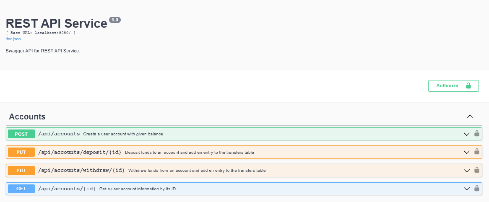

# REST API Для Работы с Балансом Пользователей на Go


### Для запуска приложения

```
make build && make run
```

Если приложение запускается впервые, необходимо применить миграции к базе данных:

```
make migrate
```

## Используемые библиотеки:

- [sqlx](https://github.com/jmoiron/sqlx) - Взаимодействие с БД.
- [goose](https://github.com/pressly/goose) - Инструмент для миграций.
- [gin](https://github.com/gin-gonic/gin) - Web-framework.
- [gin-swagger](https://github.com/swaggo/gin-swagger) - Документация API.

## Запросы

Документация swagger: http://localhost:8080/swagger/index.html

